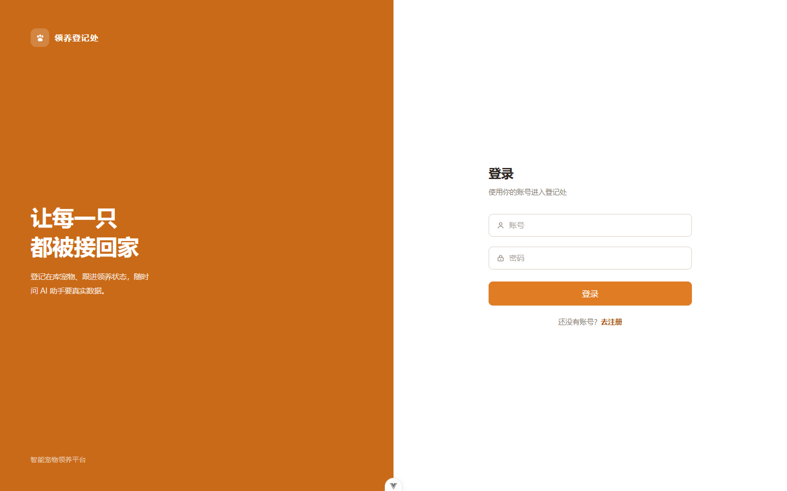
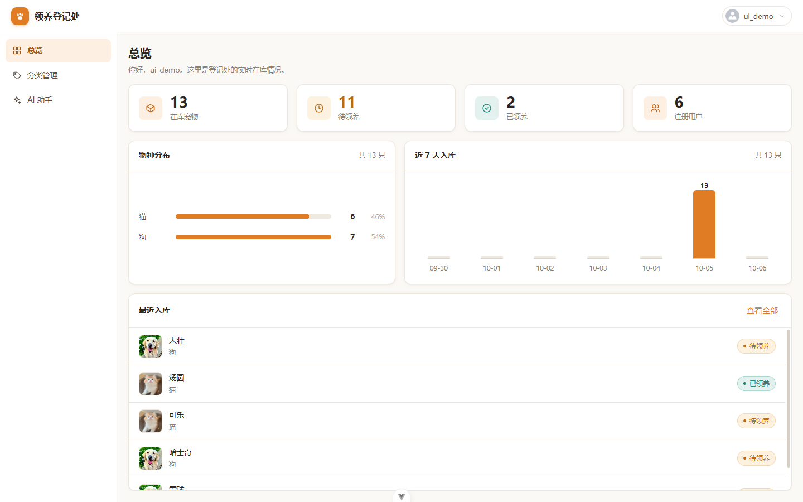
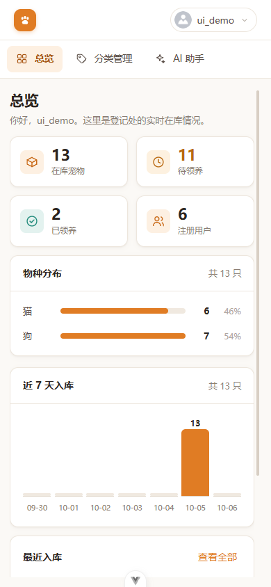
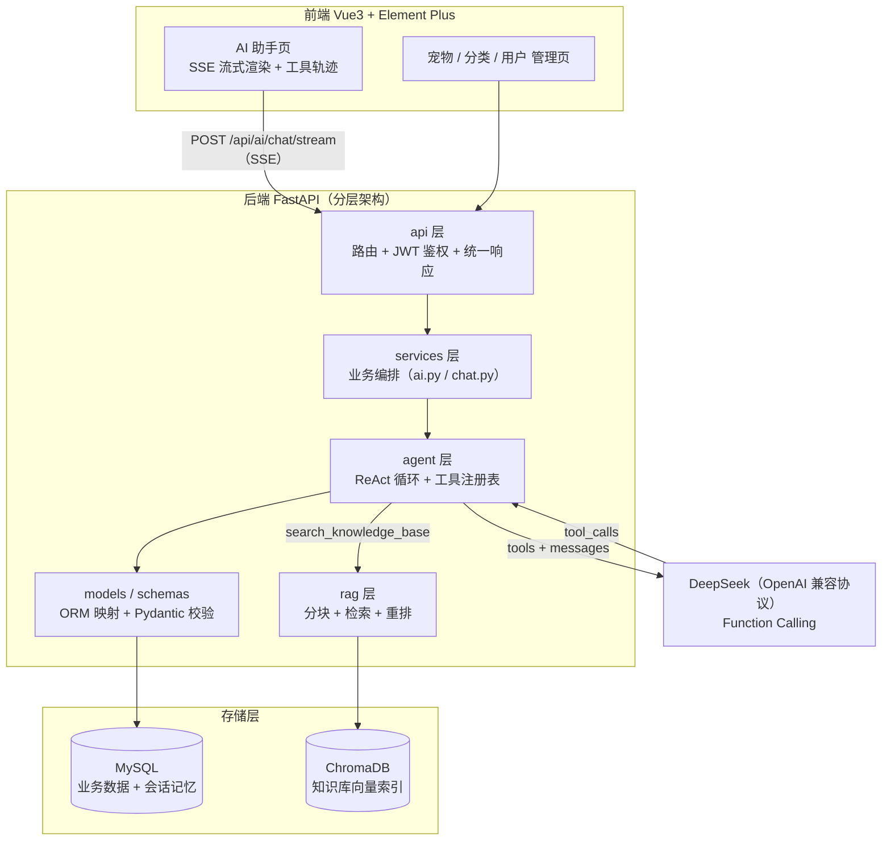
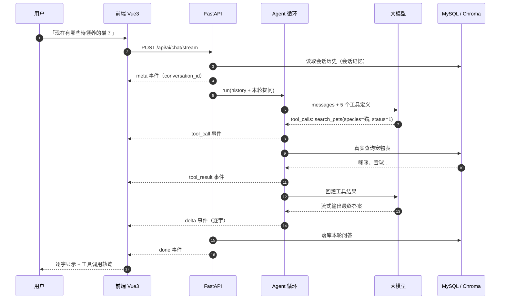

# 智能宠物领养平台 · AI Agent（全栈）

一个面向宠物领养场景的**全栈管理系统 + 可调用真实业务数据的 AI Agent**。

区别于「把 RAG 结果塞进 prompt 一问一答」的聊天机器人，本项目的 AI 助手是一个
**具备 Function Calling 能力的 Agent**：它能自主决定调用哪个工具、多步取数、再把观察结果回灌给模型，
最终生成有依据、可溯源的回答。

---

## 界面预览

| 登录 | 总览 |
|---|---|
|  |  |

移动端（390×844）：




---

## 一、技术栈

| 层次 | 选型 |
|---|---|
| 前端 | Vue 3（`<script setup>`）+ Vite + Element Plus + Vue Router + Axios |
| 后端 | FastAPI + Pydantic v2 + SQLAlchemy 2.0 + Uvicorn |
| 鉴权 | JWT（PyJWT）+ bcrypt 密码哈希 + OAuth2 Bearer |
| Agent | OpenAI 兼容协议 + Function Calling + ReAct 多步循环 + SSE 流式 |
| RAG | ChromaDB（HNSW Cosine）+ BAAI/bge-small-zh-v1.5 + 分块 + 轻量重排 |
| 数据库 | MySQL（业务数据 + 会话记忆） |
| 测试 | pytest（内存 SQLite + 伪造 LLM，**完全离线**） |

---

## 二、核心能力

### 1. 真正的 Agent，而不是聊天框

- **5 个可调用工具**，全部访问真实业务数据：

  | 工具 | 作用 |
  |---|---|
  | `search_pets` | 按关键词 / 物种 / 领养状态检索宠物库 |
  | `get_pet_detail` | 查询单只宠物的完整档案 |
  | `get_system_stats` | 获取宠物总数、领养状态、物种分布等统计 |
  | `search_knowledge_base` | 检索平台规则知识库（领养流程、审核状态等） |
  | `get_my_profile` | 查询当前登录用户资料 |

- **ReAct 多步循环**：模型可以「先搜列表 → 再查详情 → 再查规则」，最多 `AGENT_MAX_STEPS`（默认 5）步，
  带最大步数保护，避免死循环与 token 失控。
- **工具白名单 + 异常兜底**：模型幻觉出不存在的工具、或传错参数类型时，
  错误会作为 observation 回灌模型继续推理，**绝不中断整个循环**。
- **数据不透传**：宠物库存、领养状态、平台规则一律由服务端查询后回灌，
  从机制上杜绝模型编造（system prompt 明确禁止）。

### 2. SSE 流式输出

- 后端：`POST /api/ai/chat/stream`，逐事件下发
  `meta`（会话 id）→ `tool_call` / `tool_result`（工具轨迹）→ `delta`（逐字回答）→ `done`。
- 前端：用 `fetch + ReadableStream` 手动解析 SSE（**EventSource 无法携带 Authorization 头**），
  边收边渲染，并实时展示工具调用轨迹，支持「停止生成」。

### 3. 服务端会话记忆

- 对话历史落库（`conversations` / `messages` 表），不再依赖前端 localStorage。
- 会话隔离 + 越权校验：只能访问自己的会话。
- 历史只取最近 `AGENT_HISTORY_LIMIT` 条送入模型，控制上下文成本。

### 4. RAG 工程化

- **分块索引**：Markdown 按标题切章节，章节内按句子边界二次切分（带 overlap），
  解决「整篇文档当一个 chunk 导致检索被无关内容稀释」的问题。
- **余弦空间**：ChromaDB 使用 `hnsw:space=cosine`，`score = 1 - distance` 可直接解释为相似度。
- **轻量重排**：`最终分 = 0.75 × 向量分 + 0.25 × 关键词命中率`，再按阈值过滤。
- **引用溯源**：返回 `来源 / 章节 / 相关度`，答案可标注出处。
- **自动重建索引**：用文件指纹（名称 + 大小 + mtime）检测知识库变更，自动重建，无需手动干预。
- **Embedding 懒加载**：模型只在首次检索时加载，避免「导入即下载模型」。

---

## 三、系统架构



---

## 四、一次 Agent 问答的完整时序



---

## 五、目录结构

```
my-agent-project/
├── backend/
│   ├── app/
│   │   ├── api/              # 路由层：auth / user / pet / category / dashboard / file / ai
│   │   ├── common/           # 统一响应、业务异常、日志
│   │   ├── dependencies/     # 依赖注入：get_current_user / get_current_admin
│   │   ├── models/           # ORM：User / Pet / PetCategory / Conversation / Message
│   │   ├── schemas/          # Pydantic：请求校验与响应序列化
│   │   ├── services/
│   │   │   ├── agent/
│   │   │   │   ├── runner.py # ★ ReAct 循环（同步 + 流式）
│   │   │   │   └── tools.py  # ★ 工具注册表 + 5 个业务工具
│   │   │   ├── rag/
│   │   │   │   └── chunking.py  # ★ Markdown 语义分块
│   │   │   ├── ai.py         # 业务编排：会话记忆 → Agent → 落库
│   │   │   ├── chat.py       # 会话/消息持久化
│   │   │   └── kb.py         # 向量检索 + 重排 + 引用
│   │   ├── config.py         # 集中式配置（pydantic-settings）
│   │   └── main.py
│   ├── data/kb/              # 知识库源文档（Markdown）
│   ├── tests/                # ★ 离线测试（30 项）
│   ├── .env.example
│   └── requirements.txt
└── frontend/
    └── src/
        ├── api/ai.js         # ★ SSE 客户端（fetch + ReadableStream）
        ├── views/AI.vue      # ★ 流式对话页 + 工具轨迹可视化 + 会话列表
        └── ...
```

---

## 六、快速开始

### 后端

```bash
cd backend
python -m venv .venv
.venv\Scripts\activate            # Windows
pip install -r requirements.txt -r requirements-dev.txt

cp .env.example .env              # 填入数据库与大模型配置
uvicorn app.main:app --reload     # http://127.0.0.1:8000/docs
```

> **没有 MySQL？** 把 `DATABASE_URL` 改为 `sqlite:///./pet.db` 即可先跑通
> （注意：SQLite 下 `ilike` 等方言差异可能需微调）。

### 前端

```bash
cd frontend
npm install
echo "VITE_API_BASE_URL=http://127.0.0.1:8000" > src/.env.development
npm run dev                       # http://localhost:5173
```

### 跑测试

```bash
cd backend
pytest -q                         # 30 passed，全程离线：不联网、不下载模型、不需要 MySQL
```

> 想部署到云服务器？见 **[DEPLOY.md](DEPLOY.md)** —— Docker Compose 一键起，以及上线必踩的 8 个坑。

---

## 七、API 一览

| 方法 | 路径 | 说明 |
|---|---|---|
| POST | `/api/auth/login` | 登录取 token |
| POST | `/api/auth/register` | 注册 |
| POST | `/api/ai/chat` | 非流式对话（便于脚本调用与测试） |
| POST | `/api/ai/chat/stream` | **流式对话（SSE）** |
| GET | `/api/ai/conversations` | 会话列表 |
| GET | `/api/ai/conversations/{id}/messages` | 历史消息 |
| DELETE | `/api/ai/conversations/{id}` | 删除会话 |
| GET/POST/PUT/DELETE | `/api/pet` | 宠物管理（管理员） |
| GET | `/api/dashboard/stats` | 首页统计 |
| POST | `/api/files/upload` | 文件上传 |

---

## 八、踩坑与设计取舍

> 这一节是项目中最有信息量的部分，记录的是**真踩过的坑**与对应修法。

### 1. 整篇文档当成一个 chunk，检索质量必然崩

初版 `kb.py` 直接把每个 `.md` 的全文作为一个 document 入库。文档一长，
向量被整篇语义平均化，检索回来的内容噪声极大。

**修法**：按 Markdown 标题切章节 + 章节内按句子边界二次切分（`rag/chunking.py`），
并保留 `source / section` 元数据用于引用溯源。

### 2. ChromaDB 的距离值没有物理意义，别拿 `1/(1+d)` 硬凑

初版用 `score = 1 / (1 + distance)` 把距离映射成"分数"，阈值 0.5 完全是拍脑袋，
既不可解释也无法调参。

**修法**：集合创建时指定 `metadata={"hnsw:space": "cosine"}`，
此时 `distance = 1 - cos`，`score = 1 - distance` 就是标准余弦相似度，取值范围可解释、阈值有依据。

### 3. bge 系列要用「非对称」检索：查询加前缀、文档不加

bge 中文模型推荐给 **query** 加指令前缀`为这个句子生成表示以用于检索相关文章：`，文档侧不加。
两边都加或都不加都会掉点。

**修法**：只在 `col.query(query_texts=[前缀 + query])` 时拼接前缀，入库的文档保持原样。

### 4. 流式 Function Calling 的 `tool_calls` 是**分片**下发的

这是本项目最隐蔽的坑：`delta.tool_calls` 会把同一个调用的 `id`、`function.name`、
`function.arguments` **拆成多个 chunk** 陆续送来，而且 `arguments` 是**逐字符拼接**的 JSON。

**后果**：如果每收到一个 chunk 就 `json.loads(delta.function.arguments)`，必然报
`JSONDecodeError`。

**修法**：按 `tool_calls[].index` 建立一个缓冲区，累积 `id / name / arguments` 字符串，
等本轮流结束后再统一解析（见 `agent/runner.py` 的 `tool_buf`）。
测试 `test_stream_agent_emits_tool_events_then_deltas` 专门覆盖了「参数分两片下发」的场景。

### 5. FastAPI `StreamingResponse` + `Depends(get_db)` 会拿到已关闭的 session

依赖注入的 session 在**请求处理函数返回后**就会被关闭，而 `StreamingResponse` 的生成器
是在那之后才被逐步消费的 —— 结果就是流到一半报 session 已关闭。

**修法**：流式接口不注入 `get_db`，改在生成器内部 `SessionLocal()` 自建会话，
并用 `try/finally` 保证关闭（见 `api/ai.py`）。

### 6. EventSource 无法携带 Authorization 头

浏览器原生 `EventSource` 不支持自定义请求头，而本项目所有 AI 接口都要求 JWT。

**修法**：改用 `fetch + ReadableStream`，手动按 `\n\n` 切分 SSE 事件块、解析 `data:` 行，
既保留了 `Authorization` 头，也支持 `AbortController` 实现「停止生成」。

### 7. 权限判断与注册逻辑不一致

`register()` 里写死了 `role="student"`，而权限校验比较的是 `"user"` / `"admin"`。
后端不报错，但新注册用户登录后**一个业务菜单都拿不到** —— 属于联调阶段才暴露的隐性 bug。

**修法**：统一为 `user` / `admin`，并把角色常量集中管理。

### 8. 工具层必须做白名单 + 异常兜底

模型可能幻觉出不存在的工具名，或把 `limit` 传成 `"很多"`。
任何一次工具执行失败都不应该让整个 Agent 循环崩溃。

**修法**：`execute_tool()` 做三件事 —— 白名单校验、参数 JSON 解析容错、
`TypeError` / 通用异常捕获并转成**给模型看的错误文本**，让模型自己纠错重试。

### 9. 测试不能依赖 MySQL 与大模型

要跑测试就得先装 MySQL、配好 API Key、下载 embedding 模型，这种测试没人会跑。

**修法**：测试用**内存 SQLite** + **伪造的 OpenAI 客户端**（按脚本返回预设响应），
30 项测试全程离线、秒级完成，既能真实驱动 ReAct 逻辑又不依赖任何外部服务。

---

## 九、后续规划

- [ ] 工具级并发执行（同一轮多个 `tool_calls` 并行调用）
- [ ] 会话摘要压缩（长对话自动总结，降低上下文成本）
- [ ] RAG 评测集：召回率 / 命中率指标，量化调优效果
- [ ] 接入 Rerank 模型（bge-reranker）替换当前轻量重排
- [ ] Docker Compose 一键起（MySQL + 后端 + 前端）
- [ ] 工具调用链路追踪（耗时、成功率）与 Prometheus 指标
